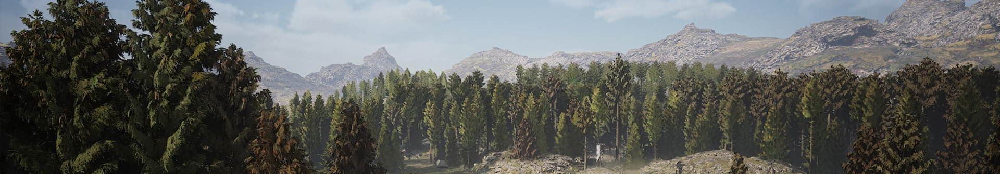
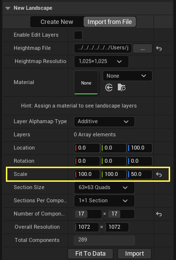

[English](/README_en_EN.md) | [Русский](/README.md)

<p align="center">
  <picture>
    <source media="(prefers-color-scheme: dark)" srcset="./media/logo-dark.png">
    
  </picture>
</p>

---

<div align="center">

[](https://github.com/AnikBeris)
[](https://github.com/AnikBeris/AutoRoleChannelBot/blob/main/LICENSE)
[](https://github.com/AnikBeris)

</div>

# Техническое руководство по ландшафтному дизайну.


> **Отказ от ответственности:** Этот проект предназначен только для личного обучения.

**Если этот проект оказался полезным для вас, вы можете оценить его, поставив звёздочку.**:star2:

<p align="left">
  <a href="https://pay.cloudtips.ru/p/7249ba98" target="_blank">
    
  </a>
</p>

Пожертвования горячо приветствуются, какими бы маленькими они ни были, и большое спасибо. 😌

| | |
|-------------:|:-------------|
| **Bitcoin (BTC)** |`1Dbwq9EP8YpF3SrLgag2EQwGASMSGLADbh`|
| **Ethereum (ERC20)** | `0x22258ea591966e830199d27dea7c542f31ed5dc5`|
| **Binance Smart Chain (BEP20)** | `0x22258ea591966e830199d27dea7c542f31ed5dc5`|
| **Solana (SOL)** | `yYYXsiVTzsvfvsMnBxfxSZEWTGytjAViE2ojf3hbLeF`|
| **Cloud tips** | [cloudtips](https://pay.cloudtips.ru/p/7249ba98) |
---




# Рекомендуемые размеры альбомной ориентации


Ниже приведен список рекомендуемых размеров ландшафта, которые позволяют максимально увеличить площадь и при этом минимизировать количество компонентов ландшафта.

|Общий размер	|  секция |	Разделы / Компонент	| Размер компонента ландшафта	| Всего компонентов ландшафта / ( чанков ) |
|:-------------|:-------------:|:-------------|:-------------|:-------------|
|8129 х 8129|	127 |	4 (2x2) |	254x254 |	1024 (32x32)|
|4033 х 4033|	63 |	4 (2x2) |	126x126 |	1024 (32x32)|
|2017 х 2017|	63 |	4 (2x2) |	126x126 |	256 (16x16)|
|1009 х 1009|	63 |	4 (2x2) |	126x126 |	64 (8x8)|
|1009 х 1009|	63 |	1       | 63x63   |	256 (16x16) |
|505 х 505|	63   |	4 (2x2)	| 126x126	| 16 (4x4)   |
|505 х 505|	63   |	1	      | 63x63	  | 64 (8x8) |
|253 х 253|	63   |	4 (2x2)	| 126x126 |	4 (2x2)  |
|253 х 253|	63   |	1	      | 63x63	  | 16 (4x4) |
|127 х 127|	63   |	4 (2x2)	| 126x126 |	1 |
|127 х 127|	63   |	1	      | 63x63	  | 4 (2x2) |

---


# Импорт карт высот

### Unreal Engine поддерживает импорт изображений карт высот в следующих форматах:

- **PNG** - `16-бит | оттенки серого`
- **r8** он же **raw8** - `8-бит | оттенки серого`
- **r16** он же **raw16** - `16-бит | оттенки серого`

>Эти форматы предпочтительны, поскольку известна их битовая глубина и предполагается, что они являются квадратными.
>
>Данные карты высот также можно импортировать с помощью формата .raw, используя отдельный файл **JSON**. Этот файл используется для определения ширины, высоты и битовой глубины вашей карты высот.
>
>Чтобы импортировать файл карты высот **.raw**, выполните следующую процедуру:

---

Создайте новый файл **.JSON**, расположенный в той же папке, что и ваша карта высот.
Назовите файл точно так же, как и вашу карту высот.
Добавьте в свой файл следующий скрипт:


	 
``` json
        {
        "width": 1024,
        "height": 1024,
      	 "bbp": 8
        }
```
В приведенном выше примере скрипт сообщает движку, что карта высот с тем же именем имеет размер 1024 x 1024 и глубину 8 бит.

---

# Расчет шкалы Z карты высот



---

Unreal Engine вычисляет высоту вашей карты высот, используя значения от **-256 до 255,992**, сохраненные с 16-битной точностью. 
Затем вычисленная высота умножается на значение шкалы **Z**, которое вы вводите при импорте данных карты высот. Например, значение шкалы **Z**, равное 1, дает максимальную высоту примерно 256 см и максимальную глубину -256 см. Таким образом, при значении шкалы **Z** по умолчанию, равном 100, ваши значения высоты будут находиться в диапазоне от 256 м до -256 м.


Настройка шкалы Z в процессе импорта.
---

Расчет пользовательской высоты требует использования коэффициента для преобразования вашего пользовательского значения высоты в диапазон от **-256** до **256**, который использует Unreal Engine. Поскольку диапазон высот составляет в общей сложности **512** единиц `(от -256 до 0 составляет 256 единиц, а от 0 до 256 — еще 256 единиц)`, коэффициент составляет 1/512 или 0,001953125.

Для этого сначала преобразуйте измерение в сантиметры, а затем умножьте на полученное соотношение.

Вот пример:

Чтобы представить Мауна-Кеа, самую высокую вершину Гавайев **высотой 4207 м**, на уровне Unreal Engine:

---
Начните с **умножения 4207 на 100**, чтобы перевести рост в сантиметры. Это равно 420 700 см.
```
4207*100
```
---
Затем **умножьте** это новое значение на соотношение: **420 700** умножить **на 0,001953125** равно 821,6796875.
или
**умножьте** это значение на соотношение: **420 700** умножить **на 512** равно 821,6796875.
```
420 700 * 0,001953125
```
---
> **полная формула** 

```
(4207*100)*0,001953125
```
или

```
(4207*100)*512
```
---

Это даст вам значение шкалы Z 821,6796875 и приведет к карте высот от -410 839 см до 410 839 см.

---

[ссылка на статью](https://dev.epicgames.com/documentation/en-us/unreal-engine/landscape-technical-guide-in-unreal-engine?application_version=5.4)


## Лицензия
Этот проект распространяется по [MIT License](https://github.com/your-repo/blob/main/LICENSE).

---

Для детальной документации ознакомьтесь с [Английским README](/README.md) или [Русским README](/README.ru_RU.md).

